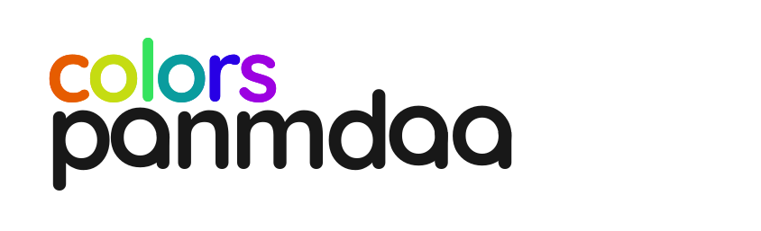

<p align="center">
  <a href="./LICENSE">
    
  </a>
  <a href="https://npmjs.org/package/@panmdaa/colors">
    
  </a>
  <a href="https://npmjs.org/package/@panmdaa/colors">
    
  </a>
  <a href="https://bundlephobia.com/result?p=@panmdaa/colors">
    
  </a>
  <a href="https://bundlephobia.com/result?p=@panmdaa/colors">
    
  </a>
</p>


# @panmdaa/colors

HCT color space, Material Design color utilities, and accessible theme generation — zero dependencies.

**`@panmdaa/colors`** is a TypeScript library for working with color in the HCT (Hue-Chroma-Tone) color space, generating Material Design 3 color schemes, and ensuring WCAG-compliant contrast ratios.

```
npm install @panmdaa/colors
```

## Quick look

```ts
import { palette, onColor, gradient } from "@panmdaa/colors";

// Generate a full Material 3 theme from a seed color
const theme = palette("#744c9d", { variant: "expressive" });
theme.light.primary;    // "#b091ce"
theme.dark.primary;     // "#dcb8ff"
theme.light.background; // "#fcfcff"

// Find a contrasting foreground for any background
onColor("#000000");       // tone ~49, 4.5:1 contrast
onColor("#000000", 7);    // tone ~65, 7.0:1 (AAA)

// Find a contrasting background for any foreground
underColor("#ffffff");    // tone ~49, 4.5:1 contrast
underColor("#ffffff", 7); // tone ~65, 7.0:1 (AAA)

// Blend multiple colors together in HCT space
mix("#ff0000", "#0000ff");                    // purple midpoint
mix("#ff0000", "#00ff00", "#0000ff");          // three-way blend

// Interpolate between two colors in HCT space
gradient("#ff0000", "#0000ff", 5);  // [red, ..., ..., ..., blue]
```

## Theme generation

10 Material Design 3 variants for both light and dark:

```ts
import { palette } from "@panmdaa/colors";

// All variants
palette("#744c9d", { variant: "monochrome" });     // Grayscale
palette("#744c9d", { variant: "neutral" });        // Muted, neutral
palette("#744c9d", { variant: "tonal-spot" });     // Default M3 — subtle tint
palette("#744c9d", { variant: "vibrant" });        // High chroma
palette("#744c9d", { variant: "expressive" });     // Rotated hues
palette("#744c9d", { variant: "fidelity" });       // Source color faithful
palette("#744c9d", { variant: "content" });        // Content-based
palette("#744c9d", { variant: "rainbow" });        // Rainbow spectrum
palette("#744c9d", { variant: "fruit-salad" });    // Colorful, playful
palette("#744c9d", { variant: "cmf" });            // Custom Material You
```

Each returns a `Theme` with `light` and `dark` palettes of 53 color roles:

```ts
const theme = palette("#744c9d", { variant: "tonal-spot" });

theme.light.primary;                  // Primary brand color
theme.light["primary-dim"];           // Dimmed variant
theme.light["on-primary"];            // Text/icon on primary
theme.light["primary-container"];     // Primary container surface
theme.light["on-primary-container"];
theme.light["primary-fixed"];
theme.light["primary-fixed-dim"];
theme.light["on-primary-fixed"];
theme.light["on-primary-fixed-variant"];
theme.light.background;
theme.light.surface;
theme.light["surface-dim"];
theme.light["surface-bright"];
theme.light["surface-container-lowest"];
theme.light["surface-container-low"];
theme.light["surface-container"];
theme.light["surface-container-high"];
theme.light["surface-container-highest"];
theme.light["surface-variant"];
theme.light["on-surface"];
theme.light["on-surface-variant"];
theme.light.outline;
theme.light["outline-variant"];
theme.light.error;
theme.light["error-dim"];
theme.light["on-error"];
theme.light.shadow;
theme.light.scrim;
theme.light["surface-tint"];
theme.light["inverse-surface"];
theme.light["inverse-on-surface"];
theme.light["inverse-primary"];
// + secondary, tertiary with all their dim/container/fixed variants
```

## Custom tokens

Extend the palette with your own tokens. Perfect for brand colors, accents, and design tokens:

```ts
const theme = palette("#6750a4", {
  variant: "tonal-spot",
  extraColors: {
    brand: "#ff6600",                       // direct color
    muted: { from: "primary" },              // copy from palette
    mutedBold: { from: "primary", adjust: { tone: -10 } },  // adjusted
    accent: { harmonize: "#ff0000" },        // harmonized with source
    random: { random: true },                // randomized near source
  },
});

theme.light.brand;            // "#ff6600"
theme.light["on-brand"];      // "#ffffff" — auto-generated foreground
theme.light.muted;            // matches primary
theme.light.mutedBold;        // primary, tone-10
```

Key behaviour:
- Names normalize to **kebab-case**: `theme.light["my-color"]`
- Every non-`on-*` token gets an auto-generated `on-{name}` with ≥4.5:1 contrast
- `from`-based tokens resolve **per-mode** (different in light/dark)
- `harmonize`, `random`, and direct hex values are **shared** across modes

## Gradients

Standalone HCT interpolation or inline in your palette:

```ts
import { gradient } from "@panmdaa/colors";

// 5-step gradient from red to blue
const steps = gradient("#ff0000", "#0000ff", 5);
steps[0]; // "#ff0000"
steps[2]; // midpoint (interpolated in HCT space)
steps[4]; // "#0000ff"

// Inline in extraColors — expands to {name}-N tokens
const theme = palette("#6750a4", {
  extraColors: {
    sunset: { gradient: { from: "#ff0000", to: "#0000ff", count: 5 } },
    ramp: { gradient: { from: "primary", to: "secondary", count: 3 } },
  },
});

theme.light["sunset-0"];     // first step of the gradient
theme.light["sunset-4"];     // last step
theme.light["on-sunset-0"];  // auto-generated foreground
theme.light["ramp-0"];       // gradient between light primary → secondary
```

`from` and `to` accept hex colors **or** palette key references (`"primary"`, `"secondary"`, etc.).

## CSS generation

Turn any theme into CSS custom properties:

```ts
import { palette, generateCSS, generateCSSSheet } from "@panmdaa/colors";

const theme = palette("#6750a4", {
  extraColors: { brand: "#ff6600" },
});

// Quick CSS string
const css = generateCSS(theme);
// :root { --color-primary: #b091ce; --color-on-primary: ... }

// Full stylesheet with light/dark blocks
const sheet = generateCSSSheet(theme);
// :root { --color-primary: ... }
// @media (prefers-color-scheme: dark) { :root { ... } }

// Custom prefix and dark selector
generateCSSSheet(theme, {
  prefix: "--md-sys-",
  darkSelector: '[data-theme="dark"]',
});
// :root { --md-sys-primary: ... }
// [data-theme="dark"] { ... }
```

## WCAG contrast reports

Audit all foreground/background pairs in your theme:

```ts
import { palette, report } from "@panmdaa/colors";

const theme = palette("#6750a4");
const { pairs, summary } = report(theme);

summary;
// { total: 14, passingAA: 14, passingAALarge: 14, passingAAA: 12 }

// Works for dark mode too
report(theme, "dark");

// Each pair includes detailed info
pairs[0];
// { role: "primary", onRole: "on-primary", fg: "#b091ce", bg: "#1e192b", ratio: 11.2, AA: true, AALarge: true, AAA: true }

// Automatically includes extraColors tokens
const theme2 = palette("#6750a4", {
  extraColors: { brand: { from: "primary" } },
});
report(theme2).pairs.some(p => p.role === "brand"); // true
```

## Color manipulation

Edit a color's HCT channels independently:

```ts
import {
  getHue, getChroma, getTone,
  setHue, setChroma, setTone,
  rotateHue, lighten, darken,
  saturate, desaturate, edit,
  tone, tones,
} from "@panmdaa/colors";

// Per-channel getters
getHue("#744c9d");     // 283
getChroma("#744c9d");  // 36
getTone("#744c9d");    // 62

// Per-channel setters (returns new color)
setHue("#744c9d", 200);     // shift hue
setChroma("#744c9d", 50);   // increase saturation
setTone("#744c9d", 80);     // lighten

// Convenience functions
lighten("#744c9d", 10);     // +10 tone
darken("#744c9d", 10);      // -10 tone
saturate("#744c9d", 20);    // +20 chroma
desaturate("#744c9d", 20);  // -20 chroma
rotateHue("#744c9d", 90);   // +90 hue

// Batch edit
edit("#744c9d", { hue: 200, chroma: 40, tone: 70 });

// Foreground / background contrast pairing
onColor("#000000");       // foreground for dark background
underColor("#ffffff");    // background for light foreground

// Get a specific tone
tone("#744c9d", 90);  // same hue/chroma, tone 90

// All reference tones at once
const ts = tones("#744c9d");
ts[50]; // tone 50 at source color's hue/chroma
```

## Color blending

```ts
import { mix } from "@panmdaa/colors";

// Blend two colors — perceptual midpoint in HCT space
mix("#ff0000", "#0000ff");  // hue ~283 (purple)

// Blend any number of colors
mix("#ff0000", "#00ff00", "#0000ff");  // three-way blend

// All inputs weighted equally, hue is circular-averaged
mix("#ff0000", "#ff0000", "#0000ff");
// ≈ mix("#ff0000", "#0000ff") with extra red weight
```

The `mix` function operates in HCT space — hue is circular-averaged (handles the
0°/360° wrap), chroma and tone are arithmetically averaged. The result is
perceptually uniform, unlike naive RGB blending.

## Color correction

```ts
import { harmonize, fixDisliked, isDisliked } from "@panmdaa/colors";

// Harmonize a color to complement another
harmonize("#ff0000", "#744c9d");  // shifts design color toward source

// Fix disliked colors (yellow-green, etc.)
isDisliked("#4a7a3f");  // true
fixDisliked("#4a7a3f"); // shifted to avoid the disliked zone
```

## Advanced: HCT color space

```ts
import { hct, fromHct } from "@panmdaa/colors";

const color = hct("#744c9d");
color.hue;    // 283
color.chroma; // 36
color.tone;   // 62

// Create a color from HCT values
fromHct(283, 36, 80);  // "#c9aae0" (same hue/chroma, tone 80)

// Convert between formats
toNumber("#744c9d");   // 7629981 (ARGB int)
fromNumber(7629981);   // "#744c9d"
```

## From images

```ts
import { fromImage } from "@panmdaa/colors";

const seed = await fromImage(imageElement); // extracts dominant color
const theme = palette(seed, { variant: "expressive" });
```

## API

| Function | Description |
|----------|-------------|
| `palette(color, options?)` | Generate light + dark theme (variant, extraColors, gradients) |
| `onColor(bg, ratio?)` | Foreground with ≥4.5:1 contrast at same hue/chroma |
| `underColor(fg, ratio?)` | Background with ≥4.5:1 contrast (inverse of `onColor`) |
| `mix(...colors)` | Blend N colors together in HCT space |
| `gradient(from, to, count)` | HCT-interpolated steps between two colors |
| `generateCSS(theme, options?)` | CSS custom properties string |
| `generateCSSSheet(theme, options?)` | Full stylesheet with light/dark blocks |
| `report(theme, mode?)` | WCAG contrast report for all `on-*` pairs |
| `toNumber(color)` | `#rrggbb` → ARGB integer |
| `fromNumber(color)` | ARGB integer → `#rrggbb` |
| `hct(color)` | `#rrggbb` → HCT color object |
| `fromHct(hue, chroma, tone)` | HCT values → `#rrggbb` |
| `getHue / getChroma / getTone` | Read a single HCT channel |
| `setHue / setChroma / setTone` | Set a single HCT channel |
| `lighten / darken` | Adjust tone |
| `saturate / desaturate` | Adjust chroma |
| `rotateHue` | Rotate hue |
| `edit(color, { hue?, chroma?, tone? })` | Batch channel edit |
| `tone(color, tone)` | Get color at a specific tone |
| `tones(color)` | All 14 reference tones at once |
| `harmonize(design, source)` | Shift a color toward a source |
| `fixDisliked(color)` | Fix disliked hue |
| `isDisliked(color)` | Check if color is in the disliked zone |
| `fromImage(image)` | Extract dominant color from an `` |

## Origins

`@panmdaa/colors` originated from Google's [Material Color Utilities](https://github.com/material-foundation/material-color-utilities) project and preserves its underlying color science (HCT, CAM16, dynamic color algorithms, quantization, etc.).

Over time, the implementation has been substantially refactored and evolved. Legacy compatibility layers, version-specific branches, and internal abstractions were removed in favor of a unified architecture with a stable, developer-oriented API.

Today, `@panmdaa/colors` is developed independently as part of the Panmdaa ecosystem while remaining compatible with the Material Design color model where appropriate.

**Key differentiators:**

- **`@panmdaa/colors`** is the only library that combines HCT color science, full M3 theme generation, custom token extensibility, contrast reports, and image quantization in a single tree-shakeable zero-dependency package.
- **Material Color Utilities** is Google's reference implementation. Its API is designed for internal Material Design usage and lacks ergonomic utilities like `palette()`, `onColor()`, `report()`, or CSS string generation.
- **Culori** and **Chroma.js** are general-purpose color manipulation libraries with excellent interpolation, but they don't generate design-system themes from a seed color.
- **Radix Colors** provides well-crafted light/dark scales for UI but doesn't handle HCT, dynamic theme generation, or programmatic color science.

## Internal architecture

```
src/
├── hct/         ← HCT color space (CAM16, viewing conditions)
├── palette/     ← TonalPalette (hue + chroma → tones)
├── scheme/      ← DynamicScheme, DynamicColor, 10 variants
├── spec/        ← Token definitions, palette specs, color calculation
├── science/     ← Blend, dislike analyzer, temperature, score
├── quantize/    ← Image quantization (Wu, Celebi)
└── utils/       ← Color/math/string utilities
```

Fork of [Material Color Utilities](https://github.com/material-foundation/material-color-utilities) (TypeScript), spec version 2026.

## Scripts

| `npm run` | Description |
|-----------|-------------|
| `build` | Bundle with tsup (ESM + DTS) |
| `test` | Run 80+ color correctness tests |
| `typecheck` | TypeScript strict check |
| `lint` | Biome lint |
| `format` | Biome format |

---
<p align="center">
  Crafted with ❤️ by the Panmdaa project.
</p>
